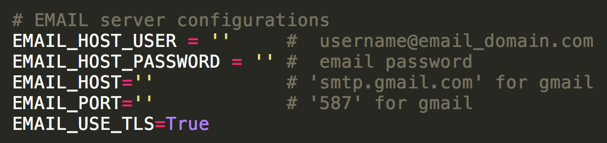
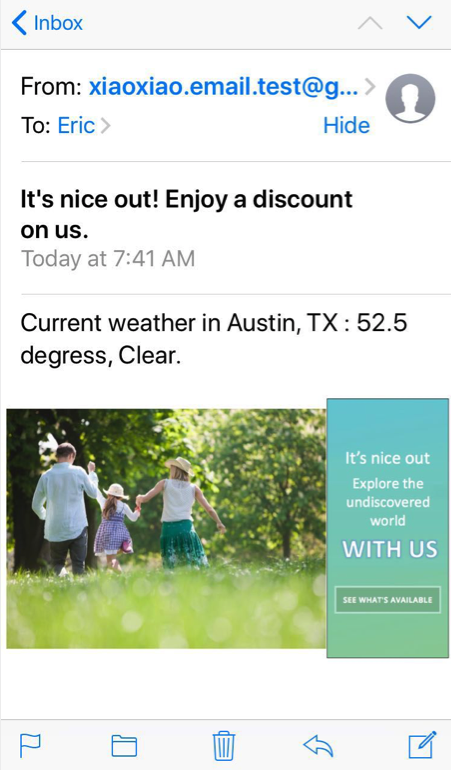
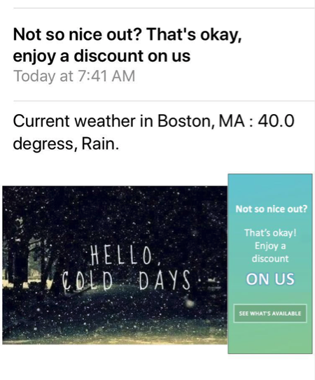
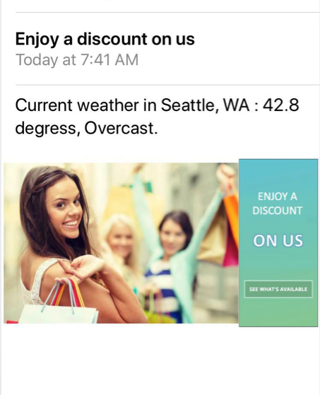

# Weather Powered Email

#### A django web application 
#### Author: Eric Liu
[Klaviyo Design specification](https://www.klaviyo.com/weather-app)

### Tech Stack:
* Language: Python 3.5.2

* Framework: Django 2.0.1

* DB: SQLite

### Features:

* Registration module:
	- Email intput validation (non-empty check, case-insensitive valid format check, **non-exist** check)
	- Location select validation (non-empty, valid format)
	- US city choices ranked by population (high to low)
	- Registration successful page confirmation
* Weather module:
	- Real-time weather information (current & history) from Wundergroud API
	- [Future] Save history temperature data (from cache) to db, good for performance on same-date repeating request
* Email module:
	- Personalized email content for each user, according to city
	- Rich email content, including user-specific subject, body and image
	
### Highlights:
* Used customized Django template and forms in creating frond-end pages
* Parameterized development on Weather and Email modules, future change only need to modify parameters
* Used cache for weather data and email content to optimize performance by avoiding making repeated API request
* Used Django management command for the email-sending task, simple as 1-click
* Used regular expression in weather string pattern detection

### To run:
a) Copy the whole **weather_email** project directory 

b) Change outgoing email server configurations in ./main\_site/main\_site/settings.py 
	
c) Source python virtual environment: 

	$ source weather_email/venv/bin/activate
		
d) Run Django Server

	$ python3 weather_email/main_site/manage.py runserver 
	
e) Open browser, open [http://127.0.0.1:8000/weather_app](http://127.0.0.1:8000/weather_app/) or [http://127.0.0.1:8000/weather_app/register](http://127.0.0.1:8000/weather_app/register)

f) (Register some emails)

g) To send email, in command_line:
	
	$ python3 weather_email/main_site/manage.py sendEmail  

### Sample effect:
* Good weather email:

	
	
* Bad weather email:

	
	
* Normal weather email:
	
	
	

	
